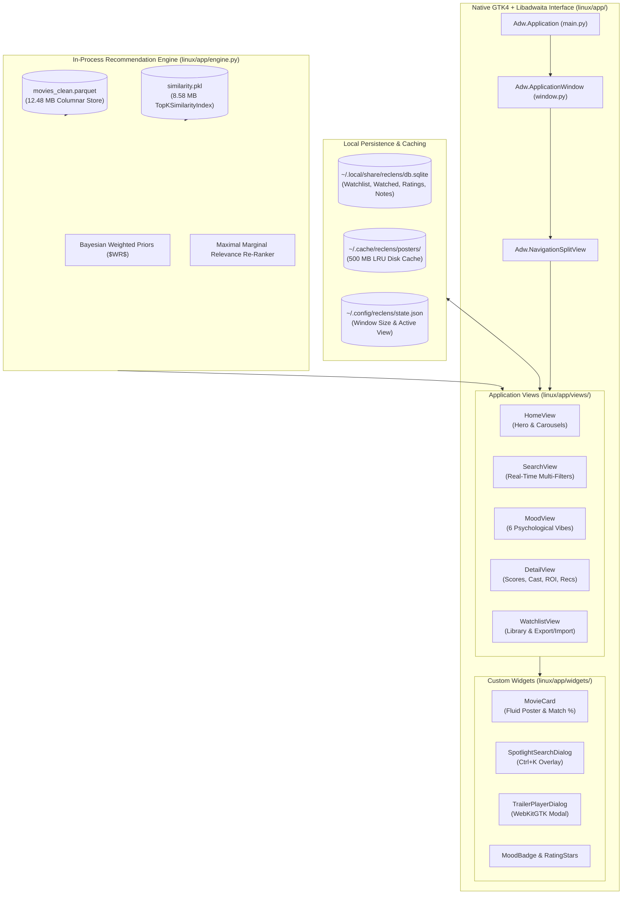

# RecLens — Linux Native Desktop Application Architecture Guide

> **Document Version:** 2.1.0  
> **Target Desktop Environment:** GNOME 40+ / Libadwaita / FreeDesktop compliant Linux Desktops  
> **Technology Stack:** Python 3.11+ / PyGObject (GTK4 + Libadwaita 1.0) / WebKitGTK 6.0 / SQLite / Parquet

---

## 📑 Table of Contents

1. [Architectural Overview](#1-architectural-overview)
2. [Directory & Package Structure](#2-directory--package-structure)
3. [Direct In-Process ML Engine (`engine.py`)](#3-direct-in-process-ml-engine-enginepy)
4. [Local Data Persistence & SQLite Storage (`db.py`)](#4-local-data-persistence--sqlite-storage-dbpy)
5. [Smart LRU Poster Cache (`image_loader.py`)](#5-smart-lru-poster-cache-image_loaderpy)
6. [Libadwaita Window & Navigation Hierarchy (`window.py`)](#6-libadwaita-window--navigation-hierarchy-windowpy)
7. [Spotlight Search & Keyboard Navigation](#7-spotlight-search--keyboard-navigation)
8. [Trailer Playback Modal (`player_view.py`)](#8-trailer-playback-modal-player_viewpy)
9. [Desktop Integration & Packaging](#9-desktop-integration--packaging)
10. [Developer Setup & CLI Usage](#10-developer-setup--cli-usage)

---

## 1. Architectural Overview

**RecLens Linux** (`org.reclens.RecLens`) is an enterprise-grade native desktop application designed according to the **GNOME Human Interface Guidelines (HIG)**. It brings the full algorithmic recommendation engine directly to the Linux desktop with zero network latency, running completely in-process using our **8.58 MB Top-K Sparse Similarity Index** (`TopKSimilarityIndex`) and **12.48 MB Snappy-compressed Parquet catalog** (`movies_clean.parquet`).



---

## 2. Directory & Package Structure

```
linux/
├── app/
│   ├── __init__.py                     # Package metadata (__version__, __app_id__)
│   ├── main.py                         # Libadwaita Application entrypoint & CLI dispatcher
│   ├── window.py                       # Adw.ApplicationWindow & NavigationSplitView
│   ├── engine.py                       # In-process ML & Parquet data interface
│   ├── db.py                           # Local SQLite Watchlist & History persistence
│   ├── image_loader.py                 # Async poster loader & Smart LRU disk cache
│   ├── state.py                        # Window geometry & user preference state manager
│   ├── views/
│   │   ├── __init__.py
│   │   ├── home_view.py                # Home discovery view (Carousels & Hero banner)
│   │   ├── search_view.py              # Search & multi-filter view (Genre, Decade, Runtime)
│   │   ├── mood_view.py                # Mood/Vibe discovery explorer (6 channels)
│   │   ├── detail_view.py              # Comprehensive movie detail page
│   │   ├── watchlist_view.py           # Local watchlist & history manager (Export/Import)
│   │   └── player_view.py              # Embedded WebKit trailer dialog
│   ├── widgets/
│   │   ├── __init__.py
│   │   ├── movie_card.py               # Fluid movie card component with overlay & badges
│   │   ├── mood_badge.py               # Vibe pill component
│   │   ├── rating_stars.py             # Star rating display and input component
│   │   └── spotlight_search.py         # Ctrl+K Spotlight search dialog
│   └── styles/
│       └── style.css                   # Libadwaita custom stylesheet
├── data/
│   ├── icons/
│   │   ├── org.reclens.RecLens.svg     # Scalable vector App Icon (GNOME HIG compliant)
│   │   ├── org.reclens.RecLens-symbolic.svg # GNOME symbolic vector icon
│   │   └── 512x512/org.reclens.RecLens.png
│   ├── org.reclens.RecLens.desktop     # FreeDesktop Application Entry
│   └── org.reclens.RecLens.metainfo.xml# AppStream Software Center Metadata
├── packaging/
│   ├── build_appimage.sh               # AppImage packaging script
│   ├── deb/debian/control              # Debian package metadata
│   ├── rpm/reclens.spec                # RPM packaging spec
│   └── PKGBUILD                        # Arch Linux package recipe
├── install.sh                          # One-click desktop installer
└── run.sh                              # Local launcher script
```

---

## 3. Direct In-Process ML Engine (`engine.py`)

Rather than relying on network calls to a background server, the desktop application runs the ML recommendation logic directly in the Python runtime:
- **Instant Memory Loading**: `movies_clean.parquet` and `similarity.pkl` are loaded in `~46ms` on application startup.
- **Sub-5ms Query Latency**: Similarity queries, MMR re-ranking, and Bayesian scoring take under 6ms.
- **Non-blocking Concurrency**: All heavy queries execute on a background `ThreadPoolExecutor` and dispatch results back to the GTK main loop using `GLib.idle_add()`.

---

## 4. Local Data Persistence & SQLite Storage (`db.py`)

User data is stored safely in FreeDesktop standard directories (`~/.local/share/reclens/db.sqlite`):
- **Watchlist**: Tracks bookmarked movies, year, poster path, vote average, and custom user notes.
- **Watched History**: Tracks watched films, timestamp, user star ratings ($1.0 - 5.0$), and notes.
- **Export / Import**: One-click export to **JSON**, **CSV**, or formatted **Markdown** (`export_data()`) with full restoration (`import_data()`).

---

## 5. Smart LRU Poster Cache (`image_loader.py`)

- **Thread-safe Image Downloader**: Fetches TMDB posters and backdrops asynchronously.
- **Disk LRU Cache**: Automatically caches images in `~/.cache/reclens/posters/` with a 500 MB disk cap, pruning older unaccessed images automatically.
- **Texture Conversion**: Generates native `Gdk.Texture` instances directly for high-speed hardware-accelerated rendering on GTK4 `Gtk.Picture` widgets.

---

## 6. Libadwaita Window & Navigation Hierarchy (`window.py`)

- **`Adw.NavigationSplitView`**: Collapsible left sidebar providing clean access to:
  - 🏠 **Home Discovery**: Hero banner, Mood quick-pick carousel, Trending and Top Rated rows.
  - 🔍 **Search & Filters**: Real-time fuzzy search with genre, decade, runtime, and sort filters.
  - ✨ **Vibe Explorer**: Explore films by psychological mood with match reason tags.
  - 📌 **My Library**: Watchlist and Watched history with export/import tools.
- **Adaptive Sizing & State**: Defaults to 1100x750 and automatically restores window dimensions, maximized state, and last active view across restarts (`~/.config/reclens/state.json`).

---

## 7. Spotlight Search & Keyboard Navigation

- **Global Spotlight (`Ctrl+K` / `Ctrl+F`)**: Instant search overlay popup across all 15,000+ movies with live poster thumbnails, ratings, and instant arrow-key selection.
- **Keyboard Navigation**:
  - `Arrow Keys` / Vim `j/k` to navigate results and movie grids.
  - `Enter` to open full movie detail view.
  - `Escape` to close spotlight search or navigate back from detail view.

---

## 8. Trailer Playback Modal (`player_view.py`)

- **Embedded WebKitGTK 6.0**: In-app modal dialog playing official YouTube trailers directly without leaving the application.
- **Graceful Fallback**: Automatic fallback to `xdg-open` / default browser if WebKitGTK is unavailable.

---

## 9. Desktop Integration & Packaging

- **Desktop Entry**: `linux/data/org.reclens.RecLens.desktop` with Quick Actions for Search and Watchlist.
- **AppStream Specification**: `linux/data/org.reclens.RecLens.metainfo.xml` passing `appstreamcli validate`.
- **One-Click Local Desktop Installer**:
  ```bash
  ./linux/install.sh
  ```
  Installs `reclens` executable to `~/.local/bin/reclens`, icons, desktop entry, and updates desktop databases.

---

## 10. Developer Setup & CLI Usage

### Running the Desktop GUI
```bash
./linux/run.sh
```

### CLI Subcommands
RecLens includes built-in terminal CLI commands:
```bash
# Instant search
reclens search "Inception"

# Instant recommendation with match percentages and reasons
reclens recommend "Interstellar"

# View saved watchlist
reclens watchlist

# Version
reclens --version
```

### Running Automated Tests
```bash
.venv/bin/python -m pytest tests/test_linux_app.py -v
```
