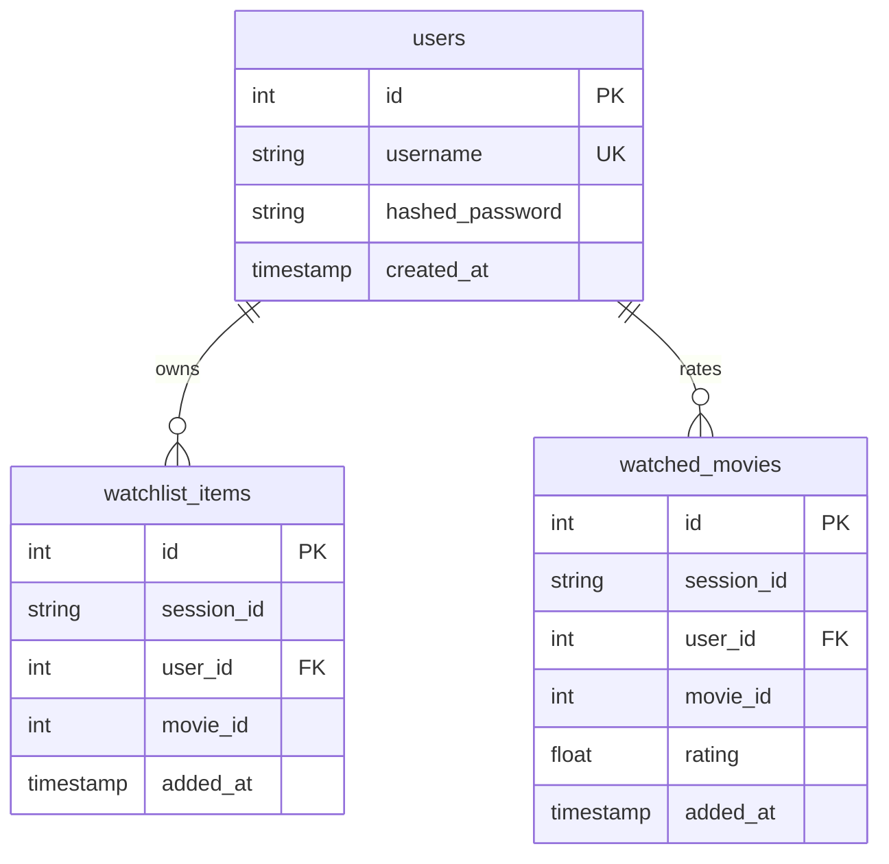

# RecLens — Technical Thesis: Design, Implementation, and Architecture of a Full-Stack Hybrid Recommendation System

## Abstract

This thesis presents **RecLens** (formerly CineMatch), an end-to-end movie recommendation application built around a dual-engine hybrid recommendation system (Content-Based and Collaborative Filtering). RecLens resolves two classic challenges in information retrieval: the cold-start problem for new users and the semantic gap in collaborative models. 

The application utilizes a modular, containerized full-stack architecture. This comprises a high-performance **FastAPI** backend, a responsive **React** web frontend styled with the Nord theme, a native **Kotlin Android** application (CineMatch Mobile), and a persistent **PostgreSQL** database. 

We cover the system architecture, machine learning foundations (TF-IDF, Cosine Similarity, Matrix Factorization, and WARP Loss), database design, user authentication with anonymous-to-registered session data migration, state synchronization patterns, and multi-container orchestration.

---

## 1. Architectural System Overview

RecLens is designed as a decoupled, multi-service architecture where presentation, application logic, and data storage layers communicate via asynchronous HTTP REST APIs.

### 1.1 Service Interaction Flow

The flow of requests through the system is managed by Nginx acting as a reverse proxy. It serves the static React application, forwards API requests to the FastAPI backend, and isolates database operations from direct external access:


### 1.2 Repository Structure & Module Map

The repository separates backend business logic, client presentation layers, machine learning pipelines, and infrastructure configuration:

- [**`backend/`**](file:///home/chaos/coding/old-github/movie-recommendation-system/backend): Fully async Python 3 FastAPI application.
  - [**`app/core/`**](file:///home/chaos/coding/old-github/movie-recommendation-system/backend/app/core): Configuration settings (`config.py`) using Pydantic Settings and database engine initialization (`database.py`) using SQLAlchemy.
  - [**`app/models/`**](file:///home/chaos/coding/old-github/movie-recommendation-system/backend/app/models): Declarative SQLAlchemy ORM models (`db.py`) defining relational tables.
  - [**`app/schemas/`**](file:///home/chaos/coding/old-github/movie-recommendation-system/backend/app/schemas): Pydantic validation models for request/response serialization.
  - [**`app/services/`**](file:///home/chaos/coding/old-github/movie-recommendation-system/backend/app/services): Content resolvers (`movie_db.py`) and recommendation loaders (`recommender.py`).
  - [**`app/api/routes/`**](file:///home/chaos/coding/old-github/movie-recommendation-system/backend/app/api/routes): Route endpoints for authorization, movie metadata, and lists management.
- [**`frontend/`**](file:///home/chaos/coding/old-github/movie-recommendation-system/frontend): React SPA powered by Vite, TypeScript, Tailwind CSS, and Zustand.
- [**`android/`**](file:///home/chaos/coding/old-github/movie-recommendation-system/android): Native Kotlin Android app using Jetpack Compose, ViewModels, and Retrofit.
- [**`nginx/`**](file:///home/chaos/coding/old-github/movie-recommendation-system/nginx): Virtual host routing configuration mapping reverse proxy paths.
- [**`scripts/`**](file:///home/chaos/coding/old-github/movie-recommendation-system/scripts): Pipelines for ML model building (`build_model.py`) and collaborative filtering training (`train_lightfm.py`).

---

## 2. Machine Learning Recommender Architecture

At the core of RecLens is a dual-tier recommendation engine designed to combine individual recommender approaches:

```
                   Recommendation Request
                             │
             ┌───────────────┴───────────────┐
             ▼                               ▼
     Content-Based                     Collaborative
     (TF-IDF + Cosine)              (LightFM Matrix Factorization)
             │                               │
             └───────────────┬───────────────┘
                             ▼
                      Hybrid Combiner
                             │
                Top-N Personalized Recommendations
```

---

### 2.1 Content-Based Filtering (TF-IDF & Cosine Similarity)

The content-based pipeline indexes text metadata from movies—including overviews, genres, cast, crew, and keywords—and constructs a normalized vector space.

#### Feature Engineering & Preprocessing
To convert raw metadata into searchable tags, the preprocessing pipeline (`src/preprocessing.py`) executes several steps:
1. **Spaces Collapsing**: Multi-word values are collapsed (e.g., `"Johnny Depp"` $\to$ `"JohnnyDepp"`, `"Science Fiction"` $\to$ `"ScienceFiction"`). This ensures they are treated as single tokens during vectorization.
2. **Feature Aggregation**: The fields `overview`, `genres`, `keywords`, `cast` (top 3 actors), and `crew` (director only) are merged into a single lowercase `tags` string.
3. **Porter Stemming**: Words are reduced to their root forms (e.g., `"loved"`, `"loves"`, `"loving"` $\to$ `"love"`) to prevent vocabulary bloat and match search intent.

#### Vector Space Construction
The aggregated terms are vectorized using the TF-IDF representation. The weight of term $t$ in document $d$ within a corpus $D$ is calculated as:

$$\text{TF-IDF}(t, d, D) = \text{TF}(t, d) \times \log \left(\frac{|D|}{1 + |\{d \in D : t \in d\}|}\right)$$

Where:
- $\text{TF}(t, d)$ is the term frequency of term $t$ in movie metadata document $d$.
- $|D|$ is the total number of movies in the catalog.
- $|\{d \in D : t \in d\}|$ is the document frequency—the number of movies containing term $t$.

This yields a sparse matrix of dimensions $N \times M$, where $N$ is the number of movies ($5000$) and $M$ is the vocabulary size (constrained to the $5000$ most significant terms).

#### Similarity Scoring
The similarity between a target movie vector $A$ and all other candidate movie vectors $B$ is measured using **Cosine Similarity**, representing the cosine of the angle between the two vectors in the inner product space:

$$\text{Cosine Similarity}(A, B) = \frac{A \cdot B}{\|A\|\|B\|} = \frac{\sum_{i=1}^{m} A_i B_i}{\sqrt{\sum_{i=1}^{m} A_i^2} \sqrt{\sum_{i=1}^{m} B_i^2}}$$

This calculates an $N \times N$ similarity matrix. The matrix is pre-calculated and pickled to `data/processed/similarity.pkl` by the build script, ensuring instant $O(1)$ similarity lookups during runtime.

---

### 2.2 Collaborative Filtering & Latent Factor Models

While content-based filtering is effective for recommending structurally similar movies, it does not capture behavioral patterns (e.g., users who like *Inception* also liking *Shutter Island* despite differences in textual descriptions). RecLens resolves this by leveraging **LightFM**, a hybrid matrix factorization library trained on MovieLens datasets.

#### Matrix Factorization
The user-item interaction matrix $R$ is decomposed into two lower-rank matrices representing latent user preferences $U$ and latent item features $V$:

$$R \approx U \times V^T$$

The model represents users and items as linear combinations of their latent features. For a user $u$ and item $i$, the predicted preference $P_{u,i}$ is:

$$P_{u,i} = f(u \cdot i + b_u + b_i)$$

Where:
- $u$ and $i$ are the latent vector representations for user $u$ and item $i$.
- $b_u$ and $b_i$ are bias terms for user $u$ and item $i$ respectively.
- $f(\cdot)$ is the identity or sigmoid function.

#### Loss Formulation: WARP Loss
RecLens trains the collaborative filtering model using **WARP Loss (Weighted Approximate-Rank Pairwise)**. Rather than optimizing pointwise prediction errors (like Mean Squared Error), WARP optimizes the ranking of items directly.

The optimization process uses SGD to minimize:

$$L_{\text{WARP}} = \sum_{u} \sum_{i \in I_u^+} L\left(\text{rank}(i)\right)$$

Where:
- $I_u^+$ is the set of positive items (rated $\ge 7.0$) for user $u$.
- $\text{rank}(i)$ represents the estimated rank of positive item $i$ in user $u$'s recommendations.
- $L(\cdot)$ is a transformation function scaling penalty values:

$$L(r) = \sum_{j=1}^{r} \frac{1}{j}$$

The rank $\text{rank}(i)$ is estimated dynamically during training. For each positive item $i$, negative items $j$ are sampled at random until a margin-violating item is found ($P_{u,j} > P_{u,i} - 1$). The rank is then estimated as:

$$\text{rank}(i) \approx \left\lfloor \frac{|I| - 1}{N} \right\rfloor$$

Where:
- $|I|$ is the total number of items.
- $N$ is the number of random sampling trials needed to find the violation.

Parameters are updated using backpropagation to push the positive item's score up and the violating negative item's score down. This ranking optimization directly enhances Top-N recommendation performance.

---

### 2.3 The Hybrid Recommender Combiner

RecLens implements a hybrid combining service inside [`recommender.py`](file:///home/chaos/coding/old-github/movie-recommendation-system/backend/app/services/recommender.py) to deal with the **Cold Start Problem**:

- **Cold Start User**: If a user has no rating history, the hybrid engine defaults entirely to **Content-Based Filtering** ($\alpha = 1.0$) using their watchlist items as seeds. If their watchlist is empty, the system falls back to popular trending items.
- **Warm User**: If a user has active ratings in the database, the system retrieves their ratings list. It computes a hybrid preference score ($S$) for all candidate movies in the catalog:

$$S_{\text{hybrid}} = \alpha \cdot S_{\text{content}} + (1 - \alpha) \cdot S_{\text{collaborative}}$$

Typically, $\alpha = 0.3$. This allows the collaborative model to guide recommendations while the content features ensure relevant matches for newer or niche movies.

---

## 3. Database Architecture & Hybrid Session Synchronization

To support watchlist and rating changes across client sessions, RecLens implements an **Anonymous-to-Authenticated Session Synchronization Pattern** on top of its database connections. 

If unauthenticated, user states are tracked using a transient browser-generated UUID transmitted via the `X-Session-ID` HTTP header. Upon registration or login, these transient states are atomically migrated and assigned to the user's permanent relational account identifier, maintaining user history continuity.

### 3.1 Relational Schema Design

The backend supports two database engines—**PostgreSQL** in production containers and **SQLite** (via `aiosqlite` driver) for local offline developer runs. Both engines share the SQLAlchemy declarative mappings in [`db.py`](file:///home/chaos/coding/old-github/movie-recommendation-system/backend/app/models/db.py):



#### User Table
Stores user accounts for secure credential-based access.
- `id` (INTEGER, Primary Key, Autoincrement): Unique identifier.
- `username` (VARCHAR(255), Unique, Indexed, Not Null): User login name.
- `hashed_password` (VARCHAR(255), Not Null): One-way cryptographically hashed password.
- `created_at` (TIMESTAMP, default UTC): Account creation timestamp.

#### WatchlistItem Table
Stores the movies users have added to their watchlist.
- `id` (INTEGER, Primary Key, Autoincrement): Primary key.
- `session_id` (VARCHAR(255), Indexed, Not Null): Tracks list items prior to user login.
- `user_id` (INTEGER, ForeignKey to `users(id)`, Nullable, Indexed): Maps items to permanent accounts once registered.
- `movie_id` (INTEGER, Not Null): Target TMDB movie ID.
- `added_at` (TIMESTAMP, default UTC): Timestamp of item creation.
- *Unique Constraints*: `uq_session_watchlist_movie(session_id, movie_id)` and `uq_user_watchlist_movie(user_id, movie_id)` to prevent duplicate entries.

#### WatchedMovie Table
Stores the movies users have watched along with their rating.
- `id` (INTEGER, Primary Key, Autoincrement): Primary key.
- `session_id` (VARCHAR(255), Indexed, Not Null): Tracks ratings prior to user login.
- `user_id` (INTEGER, ForeignKey to `users(id)`, Nullable, Indexed): Maps ratings to permanent accounts once registered.
- `movie_id` (INTEGER, Not Null): Target TMDB movie ID.
- `rating` (FLOAT, Not Null): Hashed rating value from `1.0` to `10.0`.
- `added_at` (TIMESTAMP, default UTC): Timestamp of rating submission.
- *Unique Constraints*: `uq_session_watched_movie(session_id, movie_id)` and `uq_user_watched_movie(user_id, movie_id)` to prevent duplicate entries.

---

### 3.2 Secure JWT Authentication & Session Migration

To secure endpoints and manage states, RecLens implements standard **JSON Web Token (JWT)** session flows:

- **Password Protection**: Passwords are encrypted using the Blowfish-based **bcrypt** algorithm with a work factor of 12 rounds.
- **Authorization**: Upon login, the backend constructs a JWT payload:
  $$\text{Payload} = \{\text{"sub"}: \text{"username"}, \text{"exp"}: \text{expiration\_time}\}$$
  This payload is signed using **HMAC-SHA256** with a server-side `SECRET_KEY`, providing a bearer access token to the client.
- **Session Migration Pattern**: When an anonymous user signs up or logs in, the client sends their local `anonymous_session_id` in the request body. The backend then runs an atomic transaction to associate their anonymous activity history with their permanent user account:
  ```sql
  -- Transfer watchlist items from anonymous session to user ID
  UPDATE watchlist_items 
  SET user_id = :user_id 
  WHERE session_id = :anonymous_session_id;

  -- Transfer watched ratings from anonymous session to user ID
  UPDATE watched_movies 
  SET user_id = :user_id 
  WHERE session_id = :anonymous_session_id;
  ```
  This transaction transfers all tracking items to their new account profile immediately, eliminating data loss upon signup.

---

### 3.3 Idempotent Startup Migrations

To ensure database safety and upgrades across environments without full database rebuilds, the backend executes idempotent startup migrations in `init_db()` ([`database.py`](file:///home/chaos/coding/old-github/movie-recommendation-system/backend/app/core/database.py)). On startup, it:
1. Executes `Base.metadata.create_all` to verify standard tables.
2. Interrogates table schemas via SQL inspect (`PRAGMA table_info` for SQLite, or system catalogs for PostgreSQL) to check if the `user_id` column exists.
3. Dynamically executes `ALTER TABLE` statements to safely inject the column if it is missing, avoiding crashes on existing active databases:
   ```sql
   ALTER TABLE watchlist_items ADD COLUMN user_id INTEGER REFERENCES users(id) ON DELETE CASCADE;
   ALTER TABLE watched_movies ADD COLUMN user_id INTEGER REFERENCES users(id) ON DELETE CASCADE;
   ```

---

### 3.4 Cascading Transactions

When a user marks a movie as watched, the frontend invokes a `POST /api/watched` request. The backend processes this inside a single database transaction to maintain consistency:
1. **Upsert Rating**: Adds or updates the movie entry in `watched_movies`.
2. **Remove Watchlist**: Deletes the movie from `watchlist_items` under the matching `user_id` or `session_id`, since a watched movie should no longer reside on a watchlist.
3. **Commit**: Commits the transaction, ensuring state consistency.

---

## 4. Frontend & Presentation Layer Design

The React frontend is built under the **Nord Design System**, a developer-centric color palette focused on cool pastel blues, greys, and greens.

### 4.1 Nord Design Custom Variables

Styles are managed dynamically via CSS variables in [`index.css`](file:///home/chaos/coding/old-github/movie-recommendation-system/frontend/src/index.css):

| Custom CSS Variable | Value | Nord Color Equivalent | Description |
|---------------------|-------|-----------------------|-------------|
| `--bg-primary` | `#2E3440` | Polar Night (Nord 0) | Deep slate backdrop background |
| `--bg-surface` | `#3B4252` | Polar Night (Nord 1) | Surface background for cards |
| `--accent` | `#88C0D0` | Frost (Nord 8) | Teal/sky blue for highlights & buttons |
| `--text-primary` | `#ECEFF4` | Snow Storm (Nord 6) | Crisp white for primary typography |
| `--text-muted` | `#D8DEE9` | Snow Storm (Nord 4) | Muted grey for subtext and year tags |
| `--accent-success` | `#A3BE8C` | Aurora (Nord 14) | Soft green for active ratings and success states |

---

### 4.2 State Synchronization Mechanics

The application state uses **Zustand** coupled with **React Query (TanStack Query)**:

- **Local Syncing**: On mounting, `App.tsx` calls `initStore()`. This loads local session IDs and calls `getWatchlist()` and `getWatched()` to fetch user lists from the backend.
- **Optimistic State Pattern**: Actions (like toggling watchlist items) update client-side Zustand store states immediately, and then make background API requests. If a request fails, the client rolls back to the previous state and triggers an error notification.
- **Debounced Search Input**: The global `SearchBar` component incorporates a `300ms` debounce threshold. As the user types, the UI delays execution of the API call until typing pauses. This reduces API load and optimizes search performance.

---

## 5. Deployment and Containerization

RecLens is containerized using **Docker** and orchestrated using **Docker Compose** to enable easy, self-contained deployment in production and development environments:

```
                          ┌───────────────────────────┐
                          │    Nginx Proxy Container  │
                          │        (Port 80)          │
                          └─────────────┬─────────────┘
                                        │
                         ┌──────────────┴──────────────┐
                         ▼                             ▼
            ┌────────────────────────┐    ┌────────────────────────┐
            │   Frontend Container   │    │   Backend Container    │
            │      (Port 5173)       │    │      (Port 8000)       │
            └────────────────────────┘    └────────────┬───────────┘
                                                       │
                                                       ▼
                                          ┌────────────────────────┐
                                          │   Database Container   │
                                          │      (Port 5432)       │
                                          └────────────────────────┘
```

---

### 5.1 Service Container Configuration

The system is split into four containers:

1. **`db`**: A PostgreSQL 16 database server with tables automatically created and verified on startup. It is backed by a persistent Docker volume (`pgdata`).
2. **`backend`**: Serves the FastAPI application. Because it loads local pickling files (`movies.pkl`) and compiles LightFM binaries, the image:
   - Installs `build-essential` (`gcc`) to compile matrix factorization modules.
   - Installs `pyarrow` to prevent deserialization crashes during dataset loading.
   - Installs `curl` to allow Docker's native health-check tests (`http://localhost:8000/health`) to query service availability.
3. **`frontend`**: Serves the React application. In production, the Node.js container builds the static bundle via `npm run build` and serves it using the `serve` static asset hosting library on port 5173. This is more lightweight and reliable than running the Vite hot-reloading server in production environments.
4. **`nginx`**: A reverse proxy that exposes port `80` to public networks, routing `/api/*` requests to the backend container, `/docs` to backend API documentation, and all other routes (`/*`) to the React frontend container.

For developer convenience, the dev override configuration [`docker-compose.dev.yml`](file:///home/chaos/coding/old-github/movie-recommendation-system/docker-compose.dev.yml) mounts local directories as live volumes and overrides start commands to run `npm run dev` and `uvicorn --reload`, enabling dynamic hot-reloading for code adjustments.
