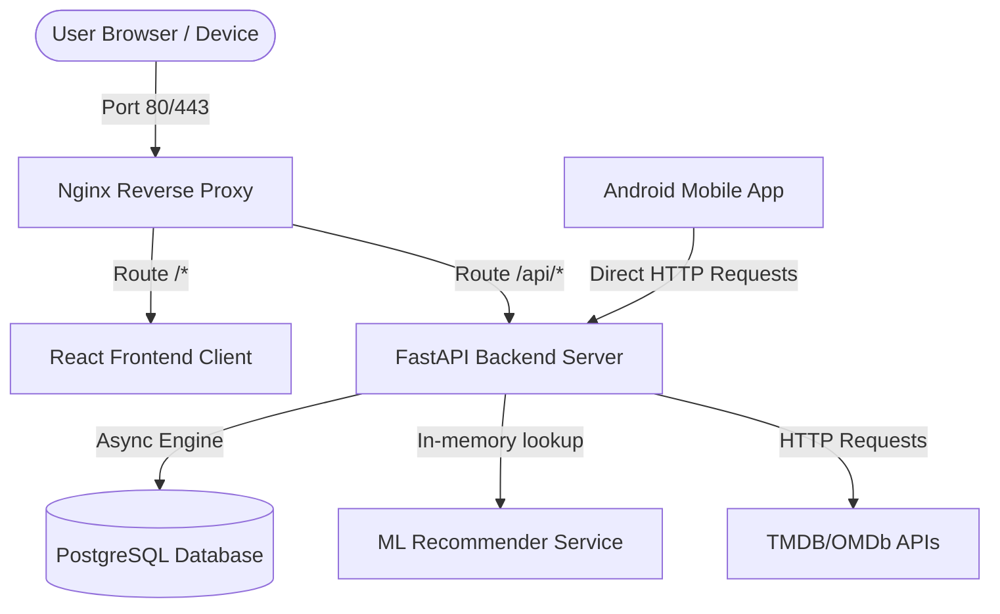

# CineMatch — Technical Thesis: Design, Implementation, and Architecture of a Full-Stack Hybrid Recommendation System

## Abstract

This report presents **CineMatch**, an end-to-end movie recommendation application built around a dual-engine hybrid recommendation system (Content-Based and Collaborative Filtering). CineMatch features a modular, containerized full-stack architecture comprising a high-performance **FastAPI** backend, a responsive **React** web frontend designed in accordance with the Nord theme, a native **Kotlin Android** application, and a persistent **PostgreSQL** database. 

This thesis covers the system architecture, machine learning foundations (TF-IDF, Cosine Similarity, Matrix Factorization, and WARP Loss), database design, state synchronization patterns, and multi-environment orchestration.

---

## 1. Architectural System Overview

CineMatch is designed as a decoupled, multi-service architecture where the presentation, application logic, and data storage layers communicate via asynchronous HTTP REST APIs.

### 1.1 Service Interaction Flow



### 1.2 Repository Structure & Module Map

The codebase is organized cleanly to separate concerns, separating backend business logic, client presentation layers, machine learning training workflows, and deployment configs:

- [**`backend/`**](file:///home/chaos/coding/old-github/movie-recommendation-system/backend): Fully async Python 3 uvicorn server.
  - [**`app/core/`**](file:///home/chaos/coding/old-github/movie-recommendation-system/backend/app/core): Configuration settings (`config.py`) and database engine initialization (`database.py`).
  - [**`app/models/`**](file:///home/chaos/coding/old-github/movie-recommendation-system/backend/app/models): Declarative SQLAlchemy models (`db.py`) for user-specific persistent states.
  - [**`app/services/`**](file:///home/chaos/coding/old-github/movie-recommendation-system/backend/app/services): Content scrapers (`movie_db.py`) and recommendation loaders (`recommender.py`).
  - [**`app/api/routes/`**](file:///home/chaos/coding/old-github/movie-recommendation-system/backend/app/api/routes): Route handlers exposing endpoints for search, detail view, database sync, and ML predictions.
- [**`frontend/`**](file:///home/chaos/coding/old-github/movie-recommendation-system/frontend): Single-page React application powered by Vite, TS, and CSS custom variables.
- [**`android/`**](file:///home/chaos/coding/old-github/movie-recommendation-system/android): Native Kotlin Android client utilizing Jetpack Compose, view-models, and retrofit.
- [**`nginx/`**](file:///home/chaos/coding/old-github/movie-recommendation-system/nginx): Virtual host routing configuration mapping Nginx endpoints.
- [**`scripts/`**](file:///home/chaos/coding/old-github/movie-recommendation-system/scripts): Pipelines for ML model building and collaborative filtering training.

---

## 2. Machine Learning Recommender Architecture

At the core of CineMatch is a dual-tier recommendation engine designed to circumvent the classic limitations of individual recommender approaches.

```
                  Recommendation Request
                            │
            ┌───────────────┴───────────────┐
            ▼                               ▼
    Content-Based                     Collaborative
     (TF-IDF + Cosine)              (LightFM Matrix Factorization)
            │                               │
            └───────────────┬───────────────┘
                            ▼
                     Hybrid Combiner
                            │
               Top-N Personalized Recommendations
```

---

### 2.1 Content-Based Filtering (TF-IDF & Cosine Similarity)

To read more about the mathematical framework of information retrieval, refer to the [TF-IDF (Wikipedia)](https://en.wikipedia.org/wiki/Tf%E2%80%93idf) article.

The content-based pipeline indexes text metadata from movies—including overviews, genres, cast, crew, and keywords—and constructs a normalized vector space.

#### Vector Space Construction
The textual attributes of each movie are flattened, stemmed (using NLTK's Porter Stemmer), and converted into a bag-of-words. The terms are vectorized using the TF-IDF representation, where the weight of term $t$ in document $d$ is:

$$\text{TF-IDF}(t, d, D) = \text{TF}(t, d) \times \log \left(\frac{|D|}{1 + |\{d \in D : t \in d\}|}\right)$$

Where:
- $\text{TF}(t, d)$ is the frequency of term $t$ in movie metadata $d$.
- $|D|$ is the total number of movies in the local database.
- $|\{d \in D : t \in d\}|$ represents the number of movies containing term $t$.

#### Similarity Scoring
To compute recommendations, similarity between a source movie vector $A$ and catalog movie vectors $B$ is measured using **Cosine Similarity**, which measures the cosine of the angle between two non-zero vectors in an inner product space:

$$\text{Cosine Similarity}(A, B) = \frac{A \cdot B}{\|A\|\|B\|} = \frac{\sum_{i=1}^{n} A_i B_i}{\sqrt{\sum_{i=1}^{n} A_i^2} \sqrt{\sum_{i=1}^{n} B_i^2}}$$

To read more on this vector space projection metric, refer to the [Cosine Similarity (Wikipedia)](https://en.wikipedia.org/wiki/Cosine_similarity) article.

---

### 2.2 Collaborative Filtering & Latent Factor Models

To read more on user-item interaction modeling, refer to the [Collaborative Filtering (Wikipedia)](https://en.wikipedia.org/wiki/Collaborative_filtering) article.

While content-based filtering is excellent for recommending structurally similar movies, it fails to capture behavioral patterns (e.g., users who like *Avatar* also liking *Star Trek* despite differences in textual descriptions). CineMatch resolves this by leveraging **LightFM**, a hybrid matrix factorization library trained on the MovieLens datasets (1M and 32M ratings versions).

#### Matrix Factorization
The user-item interaction matrix $R$ is decomposed into two lower-rank matrices representing latent user preferences $U$ and latent item features $V$:

$$R \approx U \times V^T$$

To read more about this linear algebraic representation, see the [Matrix Factorization (Wikipedia)](https://en.wikipedia.org/wiki/Matrix_factorization_(recommender_systems)) article.

#### Loss Formulation: WARP Loss
CineMatch trains the collaborative filtering model using **WARP Loss (Weighted Approximate-Rank Pairwise)**. Unlike traditional SGD losses that optimize point-wise prediction error (such as MSE), WARP optimizes the ranking of items directly. It does this by randomly sampling negative items until a violating item (one that is ranked higher than a known positive item) is found, and then updates parameters to push the positive item above the violating negative. This makes the model highly accurate for "Top-N" recommendation tasks.

---

### 2.3 The Hybrid Recommender Combiner

To read more about combining multiple filtering algorithms, see the [Hybrid Recommender Systems (Wikipedia)](https://en.wikipedia.org/wiki/Hybrid_recommender_system) article.

CineMatch implements a hybrid combining service inside [`recommender.py`](file:///home/chaos/coding/old-github/movie-recommendation-system/backend/app/services/recommender.py) to deal with the **Cold Start Problem**:

- **Cold Start (New User)**: If a user has no ratings in the database, the hybrid engine defaults entirely to **Content-Based Similarity** ($\alpha = 1.0$), using the items in their watchlist as seeds.
- **Warm User**: If a user has established ratings in the database, their ratings are retrieved. The system computes a weighted combination score ($S$) for all candidate movies:

$$S_{\text{hybrid}} = \alpha \cdot S_{\text{content}} + (1 - \alpha) \cdot S_{\text{collaborative}}$$

Typically, $\alpha = 0.3$, letting the collaborative model dominate while content features guide predictions for less-rated titles.

---

## 3. Database Architecture & Stateless Sync Pattern

To support watchlists and ratings across sessions without introducing heavy, friction-laden username/password authentication walls, CineMatch implements an **Anonymous Session Synchronization Pattern** on top of its database connection.

```
       Client Device                        FastAPI Backend                   PostgreSQL/SQLite
  ┌──────────────────────┐             ┌───────────────────────┐            ┌───────────────────┐
  │ Reads/Generates      │             │                       │            │                   │
  │ cinematch-session-id │             │                       │            │                   │
  └──────────┬───────────┘             └───────────────────────┘            └───────────────────┘
             │                                     │                                  │
             │─── GET /api/watchlist (Header) ────►│                                  │
             │    X-Session-ID: <UUID>             │─── SELECT * FROM watchlist ─────►│
             │                                     │    WHERE session_id = <UUID>     │
             │                                     │◄── [List of Movie IDs] ──────────│
             │◄── [List of Movie IDs] ─────────────│                                  │
```

### 3.1 Relational Schema Design

The backend supports two database engines—**PostgreSQL** in production containers and **SQLite** (via `aiosqlite` driver) for zero-config offline developer environments. Both engines share the same SQLAlchemy declarative mapping in [`db.py`](file:///home/chaos/coding/old-github/movie-recommendation-system/backend/app/models/db.py):

#### WatchlistItem Table
Stores movies the user wants to watch, mapped to their anonymous session ID.
- `id` (INTEGER, Primary Key, Autoincrement)
- `session_id` (VARCHAR(255), Indexed, Not Null)
- `movie_id` (INTEGER, Not Null)
- `added_at` (TIMESTAMP, defaults to UTC now)
- *Unique Constraint*: `(session_id, movie_id)`

#### WatchedMovie Table
Stores movies the user has rated, mapped to their anonymous session ID.
- `id` (INTEGER, Primary Key, Autoincrement)
- `session_id` (VARCHAR(255), Indexed, Not Null)
- `movie_id` (INTEGER, Not Null)
- `rating` (FLOAT, Not Null) — value ranges from `0.5` to `10.0`
- `added_at` (TIMESTAMP, defaults to UTC now)
- *Unique Constraint*: `(session_id, movie_id)`

### 3.2 Cascading Transactions
When a user clicks "Mark as Watched" on a movie details card, the frontend invokes a `POST /api/watched` request. The backend processes this inside a single transaction:
1. Adds/Updates the movie in `watched_movies`.
2. Deletes the movie from `watchlist_items` (under the same `session_id` and `movie_id`).
3. Commits the transaction, ensuring state consistency.

---

## 4. Frontend & Presentation Layer Design

The React frontend has been built under the **Nord Design System**, a harmonious, developer-centric color palette focused on cool pastel blues, greys, and greens.

### 4.1 Nord Design Custom Variables
Styles are managed dynamically via CSS variables in [`index.css`](file:///home/chaos/coding/old-github/movie-recommendation-system/frontend/src/index.css):
- `--bg-primary`: `#2E3440` (Polar Night 1 — deep slate background)
- `--bg-surface` / `--bg-card`: `#3B4252` (Polar Night 2 — card background)
- `--accent`: `#88C0D0` (Frost 2 — teal/sky blue buttons & highlight borders)
- `--text-primary`: `#ECEFF4` (Snow Storm 3 — crisp white text)
- `--text-muted`: `#D8DEE9` (Snow Storm 1 — soft grey text)

### 4.2 State Synchronization Mechanics
The application state uses **Zustand** coupled with **React Query (TanStack Query)**:
- On mount, `App.tsx` calls `initStore()`.
- `initStore()` fires `getWatchlist()` and `getWatched()` to load state from the database.
- Action handlers (e.g. `addToWatchlist`) run the database request asynchronously, and update the store's in-memory lists only on success.
- Queries for recommendations depend reactively on changes in the rating list, forcing automatic, real-time recalculation of the personalized grid.

---

## 5. Deployment and Containerization

CineMatch is containerized using **Docker** and orchestrated using **Docker Compose** to enable easy deployment in production and development environments:

1. **`db`**: A PostgreSQL 16 server with database tables automatically initialized at startup.
2. **`backend`**: Serves the FastAPI server using Uvicorn.
3. **`frontend`**: Serves the React application.
4. **`nginx`**: A reverse proxy that exposes port `80` to route client queries, forwarding `/api/*` to the backend and `/*` to the frontend.

For developer convenience, [`docker-compose.dev.yml`](file:///home/chaos/coding/old-github/movie-recommendation-system/docker-compose.dev.yml) overrides the services to mount local files as volumes, enabling instant hot-reloading for code changes.
